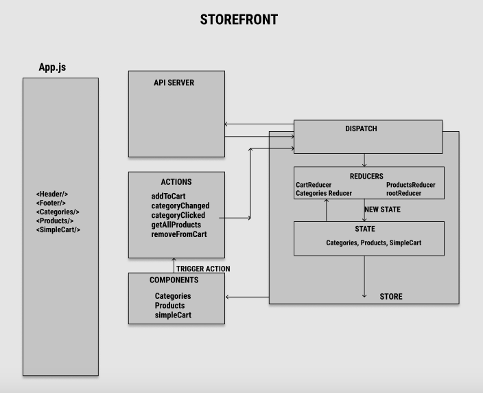

## storefront: An e-Commerce storefront created with React, Redux, and Material-UI coupled with my live API server

### Author: Riva Davidowski

**Phase 1:**
In this first phase, my goal is to setup the basic scaffolding of the application with initial styling and basic behaviors. This initial build sets up the file structure and state management so that I can progressively build the app in a scalable manner.

**Phase 2:**
In this phase, I add the “Add to Cart” feature to the application, which allows users to not only browse items in the store, but also select them and have them persist in their shopping cart for later purchase.

**Phase 3:** 
This phase involves connecting the store to an API to retrieve live data from a data source and using Thunk to enable asynchronous actions. For this phase, I connected my other app, APi-Server which can be backed by any data model.

### Dependencies:

- This project was created with [Create React App](https://github.com/facebook/create-react-app).
- To create a React application, run `npx create-react-app` (name of project here, all lowercase)
- To install it globally, run `npm install -g create-react-app`
- Install Material- UI for styling: `npm install @material-ui/core`
- Install Redux: `npm i --save redux react-redux`

### Using the storefront App: Clone the repo and do an `npm i`. This will install create-react-app and all other dependencies needed for the project to run. Make sure you have Node.js installed and as listed below, to start the app, run `npm start` in the project directory.

### UML:

**Getting Started with Create React App**

### Available Scripts

In the project directory, you can run:

### `npm start`

Runs the app in the development mode.\
Open [http://localhost:3000](http://localhost:3000) to view it in the browser.

The page will reload if you make edits.\
You will also see any lint errors in the console.

### `npm test`

Launches the test runner in the interactive watch mode.\
See the section about [running tests](https://facebook.github.io/create-react-app/docs/running-tests) for more information.

### `npm run build`

Builds the app for production to the `build` folder.\
It correctly bundles React in production mode and optimizes the build for the best performance.

The build is minified and the filenames include the hashes.\
Your app is ready to be deployed!

See the section about [deployment](https://facebook.github.io/create-react-app/docs/deployment) for more information.
